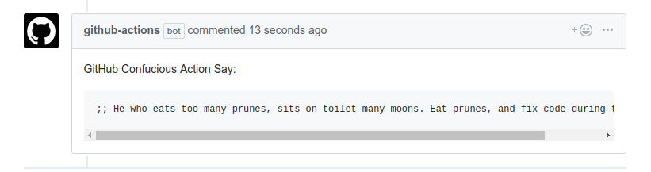
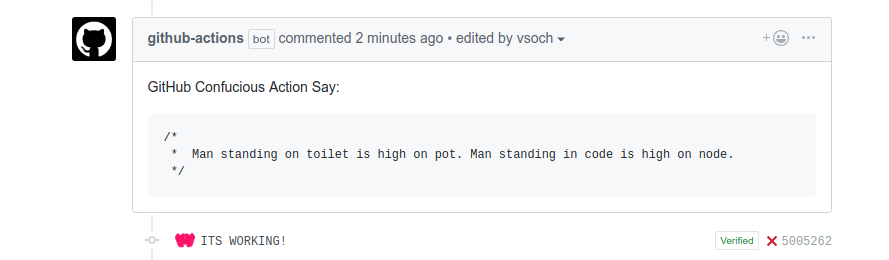
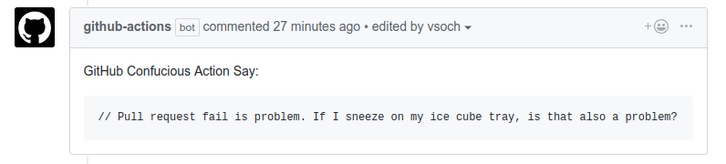
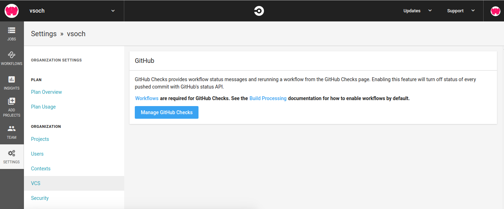

# Confucious Actions

What could be better than a ludicrous and sarcastic comment when you perform
some action on a Github pull request? This repository provides those actions,
with specific action types corresponding to the subfolders. We currently have:

 - [Pull Request Failure](pull_request_fail): Some wisdom when a pull request has status "failure"

These actions use the 
[vanessa/boxes](https://www.github.com/vsoch/boxes) container to format
a lovely message from Confucious to your pull requests, but only if you fail.
Here are some examples!

See the README.md in each subfolder for usage.

## CircleCI Setup
If you are checking status failures just for Github Actions, you don't need
to take further action. However, if you are using CircleCI, you need
to also [enable Github Checks for CircleCI](https://circleci.com/blog/see-the-status-of-your-circleci-workflows-in-github/)
to return status checks, otherwise they won't be registered.

## Travis CI

Support for Github Checks is available on travis-ci.com, for details
read [this post](https://blog.travis-ci.com/2018-05-07-announcing-support-for-github-checks-api-on-travis-ci-com).

